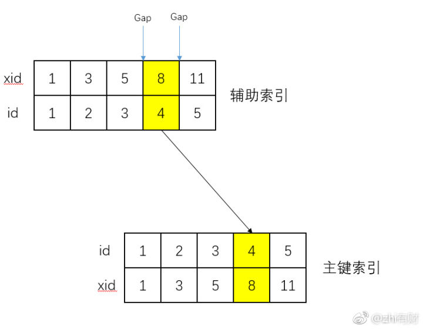

# 锁

## 乐观锁、悲观锁

属于广义上的分类

* 悲观锁：总是假设最坏的情况，每次去拿数据的时候都认为别人会修改，所以每次在拿数据的时候都会上锁，这样别人想拿这个数据就会阻塞直到它拿到锁。
* 乐观锁：顾名思义，就是很乐观，每次去拿数据的时候都认为别人不会修改，所以不会上锁。可使用版本号或CAS（compare and swap）机制。

CAS问题：
* ABA问题。A变成B又变回A，如使用版本号机制，则当前的A版本为3，而期望的A版本应是1。
* CAS自旋问题。即swap失败后循环重试直到成功。资源竞争较大时，使用悲观锁可以降低CPU资源占用。
* 不支持多个共享变量的原子操作。


## 共享锁（又称读锁，shared locks）、排它锁（又称写锁，exclusive locks）、意向锁（intention locks）

是InnoDB锁的基础

* 共享锁（S）：允许一个事务去读一行，阻止其他事务获得相同数据集的排他锁。
* 排他锁（X)：允许获得排他锁的事务更新数据，阻止其他事务取得相同数据集的共享读锁和排他写锁。
* 意向共享锁（IS）：事务打算给数据行加行共享锁，事务在给一个数据行加共享锁前必须先取得该表的IS锁。
* 意向排他锁（IX）：事务打算给数据行加行排他锁，事务在给一个数据行加排他锁前必须先取得该表的IX锁。

共享锁和排他锁都是行锁，意向锁都是表锁，应用中我们只会使用到共享锁和排他锁，意向锁是mysql内部使用的，不需要用户干预。
意向锁的作用就是当一个事务在需要获取资源锁定的时候，如果遇到自己需要的资源已经被排他锁占用的时候，该事务可以需要锁定行的表上面添加一个合适的意向锁。

对于普通SELECT语句，InnoDB不会加任何锁，事务可以通过以下语句显示给记录集加共享锁或排他锁：
* 共享锁（S）：SELECT * FROM table_name WHERE ... LOCK IN SHARE MODE。
* 排他锁（X)：SELECT * FROM table_name WHERE ... FOR UPDATE。

InnoDB行锁是通过给索引上的索引项加锁来实现的，因此InnoDB这种行锁实现特点意味着：只有通过索引条件检索数据，InnoDB才使用行级锁，否则，InnoDB将使用表锁！

即便在条件中使用了索引字段，但是否使用索引来检索数据是由MySQL通过判断不同执行计划的代价来决定的，如果MySQL认为全表扫描效率更高，比如对一些很小的表，它就不会使用索引，这种情况下InnoDB将使用表锁，而不是行锁。因此，在分析锁冲突时，别忘了检查SQL的执行计划，以确认是否真正使用了索引。

## InnoDB锁类型

### 记录锁（record locks）

锁住一条索引记录。例如SELECT c1 FROM t WHERE c1 = 10 FOR UPDATE，会阻止其他事务增删改c1 = 10的记录。

没有建立索引时，InnoDB会创建默认索引，此时记录锁依然生效。

在read committed级别下，如果没有匹配的记录，则记录锁会在where执行后释放。

### 间隙锁（gap locks）

参考https://www.jianshu.com/p/bf862c37c4c9里的讲解。

* 锁住一个范围的索引记录。例如SELECT c1 FROM t WHERE c1 BETWEEN 10 and 20 FOR UPDATE，会阻止其他事务插入c1为15的记录。
* 使用unique index查询单条记录不会使用间隙锁。如SELECT * FROM child WHERE id = 100。如果示例中id不为unique index则会使用间隙锁。
* 间隙锁的目的是阻止其他事务在范围内插入数据。
* 共享间隙锁和排他间隙锁没有差别，可同时存在于相同间隙。原因是为了使在索引中被清除的记录会被其他事务合并。
* 将事务隔离级别改为read committed后，在搜索和索引扫描时会禁用间隙锁。此时间隙锁只用来做外键约束和重复键的检查。

### next-key locks

#### 参考
* https://zhuanlan.zhihu.com/p/35477890
* https://stackoverflow.com/questions/56828411/why-next-key-lock-is-called-this-way

#### 概念
* next-key锁是记录锁和间隙锁的组合，锁在索引记录和该记录之前的间隙，即一个事务锁住索引为R的记录后，其他事务无法在R之前的间隙插入新记录。
* 如果索引包含10, 11, 13, 20，则可能会存在以下next-key锁：
```
(negative infinity, 10]
(10, 11]
(11, 13]
(13, 20]
(20, positive infinity)
```
* 在repeatable read隔离级别下，InnoDB使用在搜索以及扫描index时使用next-key锁来防止幻读。

#### 个人理解



以where akey = 2，akey为非唯一索引为例。next-key锁锁住的间隙是 当前索引中akey=2与前一个key和后一个key之间的间隙，也就是说在对应的B+树叶子节点中不会再在与之相邻的两个节点区间插入新的索引。

锁住区间的原因，是因为其他事物可能会在该区间内插入 akey=2 的索引记录，如果不锁住会导致幻读，即第二次select会发现akey=2的结果集变化了。

如果akey为唯一索引且akey=2索引值存在，其前后区间不存在插入akey=2的可能，此时不会有间隙锁。如果索引值不存在，依然会存在间隙锁。

### 插入意向锁（insert intention locks）

插入意向锁是insert操作在插入行之前设置的一种间隙锁。用来表明一种插入意向，当多个事务在同一个索引间隙不同位置插入时不需要互相等待。如两个事务在4~7索引值间隙中插入5和6，在获取排它锁之前，使用插入意向锁锁住索引间隙。

### 自增锁（AUTO-INC locks）

是一种特殊的表级锁，事务向包含AUTO_INCREMENT列的表插入时使用。